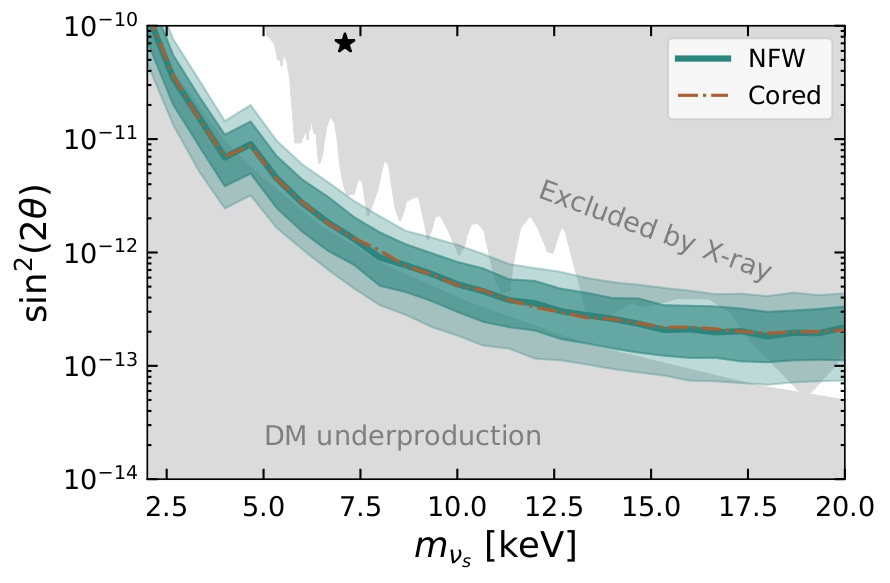
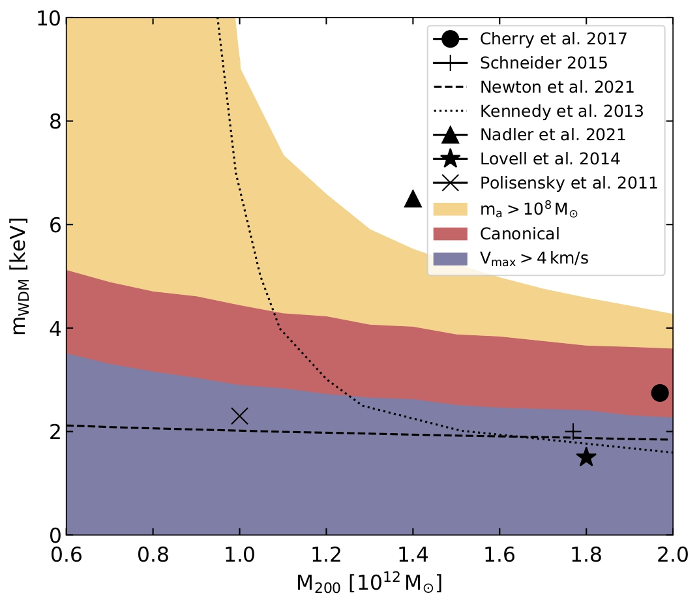
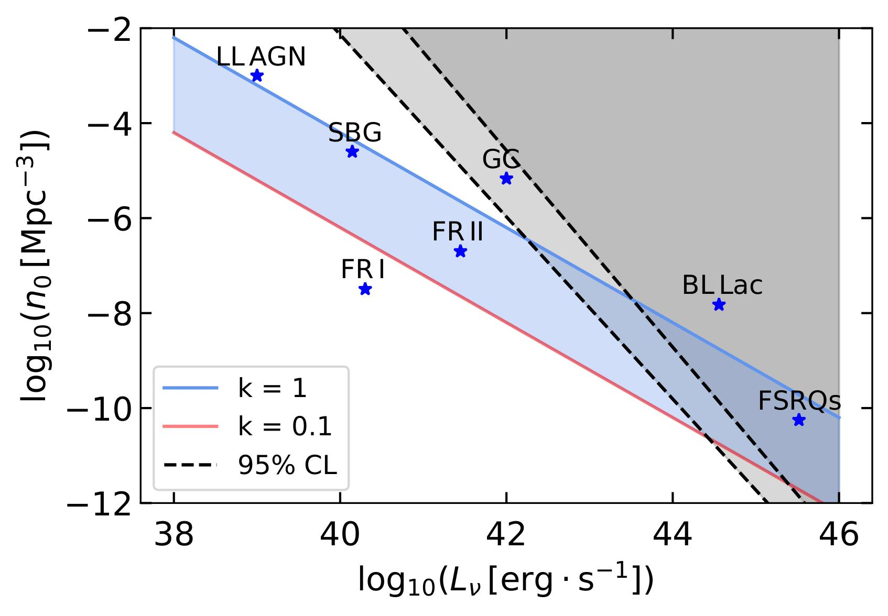

&nbsp; 

#### Indirect dark matter searches
Dark matter particles can decay or annihilate into Standard Model particles. 
<!-- The flux of those secondary products can be detected, and are best identified when coming from regions in the astrophysical sky with a high dark matter flux.  -->
The Milky-Way is embedded in a large dark matter halo, and the Galactic halo therefore offers an ideal place to search for dark matter through their secondary flux by indirect detection. In [Dekker et al. (2021)](https://journals.aps.org/prd/abstract/10.1103/PhysRevD.104.023021) we present dark matter sensitivities on warm dark matter candidates using future X-ray observations of eROSITA and in [Calore et al. (2022)](https://arxiv.org/abs/2209.06299) constraints on light dark matter with INTEGRAL/SPI obserbations. Applying an angular power spectrum analysis, we present in [Dekker et al. (2020)](https://iopscience.iop.org/article/10.1088/1475-7516/2020/09/007) and [Basegmez du Pree. (2021)](https://iopscience.iop.org/article/10.1088/1475-7516/2021/05/054) limits on dark matter using high-energy neutrino observations of IceCube and KM3NeT. 

&nbsp; 
&nbsp; 
&nbsp; 
&nbsp; 
&nbsp; 

<!-- ####### -->

&nbsp; 

#### Dark matter subhalos
The abundance of dark matter subhalos in the Milky-Way halo can be used to distinguish between dark matter models. Satellite galaxies live within subhalos and are observable. In [Dekker et al. (2022)](https://journals.aps.org/prd/abstract/10.1103/PhysRevD.106.123026) we predict the abundance of Milky-Way satellites using the Semi-Analytical SubHalo Inference Modeling (sashimi) codes (available [here](https://github.com/shinichiroando/sashimi-w)) and compare them with the observations from the Dark Energy Survey and PanSTARRS1 to set stringent constraints on warm dark matter models. 

&nbsp; 
&nbsp; 
&nbsp; 
&nbsp; 
&nbsp; 
&nbsp; 
&nbsp; 

<!-- ####### -->

&nbsp; 

#### High energy neutrinos
Astrophysical neutrinos with Tev and PeV energies have been detected with IceCube in the last decade. Neutrinos travel in an unattenuated and undeviated path towards Earth and can therefore provide insight into acceleration processes, on the origin of high-energy cosmic rays and on the potential discovery of new distant sources. In [Dekker et al. (2019)](https://doi.org/10.1088/1475-7516/2019/02/002) we constrain the contribution of astrophysical source populations to the observed neutrino sky by considering isotropic and anisotropic components of the diffuse neutrino data. With current data, rare and bright source classes can be constrained.  

&nbsp; 
&nbsp; 
&nbsp; 
&nbsp; 
&nbsp; 

<!-- ####### -->