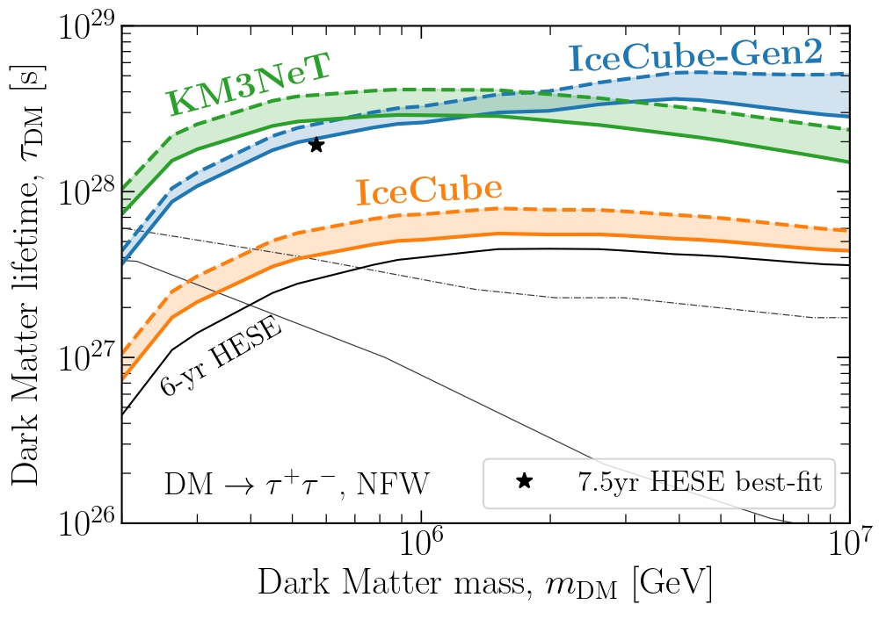

## Indirect dark matter searches
gnkjsgjhjggsj

***

<!-- ####### -->

{: style="float: left"}

skgbkjsdgkjdsgjhs

<!-- ####### -->

&nbsp; 
&nbsp; 

## High energy neutrinos
gnkjsgjhjggsj

<!-- ####### -->

&nbsp; 
&nbsp; 

## Dark matter subhalos
gnkjsgjhjggsj

<!-- ####### -->