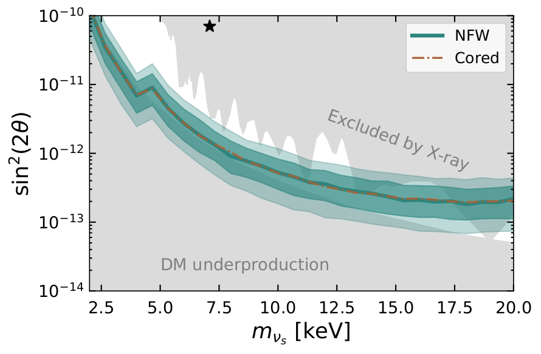
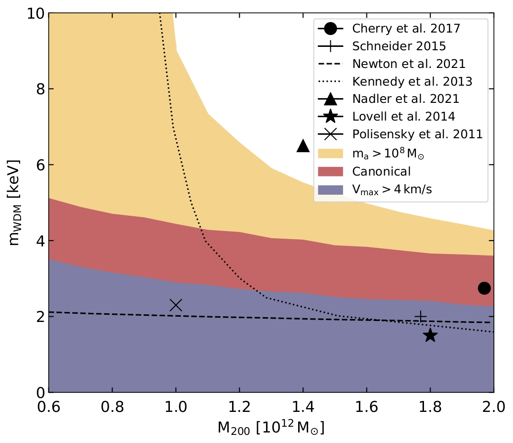
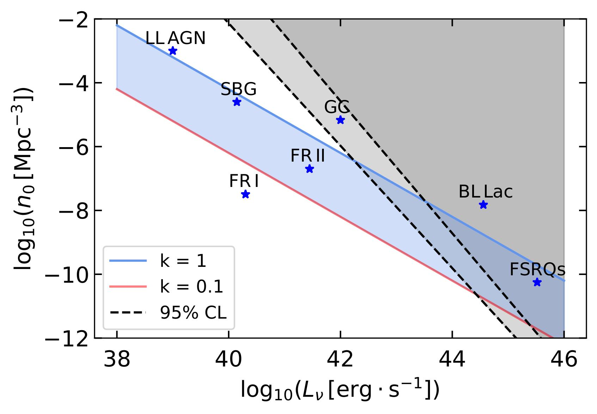

&nbsp; 

#### Indirect dark matter searches
Dark matter can decay, annihilate or oscillate into Standard Model particles, leading to characteristic spatial and spectral anomalies in the astrophysical sky. 
<!-- The flux of those secondary products can be detected, and are best identified when coming from regions in the astrophysical sky with a high dark matter flux.  -->
<!--The Milky-Way is embedded in a massive dark matter halo and therefore offers a powerful laboratory to search for these signatures using multi-messenger observations. -->
My work combines particle dark matter models with astrophysical modeling to derive constraints on dark matter scenarios from keV to PeV energies. In the X-ray and MeV bands, we analyzed eROSITA forecasts [Dekker et al. (2021)](https://journals.aps.org/prd/abstract/10.1103/PhysRevD.104.023021) and INTEGRAL/SPI data [Calore et al. (2023)](https://academic.oup.com/mnras/article/520/3/4167/7036784?login=false) to set leading limits on light and decaying dark matter candidates. 
   Neutrinos provide a unique complementary probe for heavy dark matter, and we set stringent limits on various dark matter models and by applying angular power spectrum and Monte Carlo methods in [Dekker et al. (2020)](https://iopscience.iop.org/article/10.1088/1475-7516/2020/09/007) and [Basegmez du Pree et al. (2021)](https://iopscience.iop.org/article/10.1088/1475-7516/2021/05/054), and likelihood analysis with future mock KM3NeT data [Ng et al. (2020)](https://arxiv.org/abs/2007.03692). Moreover, multi-messenger observations of Active Galactic Nuclei are promising targets for axion-like particles, as we showed in [Dekker et al. (2025)](https://arxiv.org/abs/2007.03692). 
   
   
<!--   At higher energies, I derived competitive constraints on heavy dark matter using neutrino anisotropies with IceCube and KM3NeT forecasts.-->
<!--In [Dekker et al. (2021)](https://journals.aps.org/prd/abstract/10.1103/PhysRevD.104.023021) we present dark matter sensitivities on warm dark matter candidates using future X-ray observations of eROSITA, in [Calore et al. (2022)](https://arxiv.org/abs/2209.06299) constraints on light dark matter with INTEGRAL/SPI obserbations. By studying angular clustering of neutrino events, we present in [Dekker et al. (2020)](https://iopscience.iop.org/article/10.1088/1475-7516/2020/09/007) and [Basegmez du Pree. (2021)](https://iopscience.iop.org/article/10.1088/1475-7516/2021/05/054) limits on dark matter using high-energy neutrino observations of IceCube and KM3NeT. -->

&nbsp; 
&nbsp; 
&nbsp; 
&nbsp; 

<!-- ####### -->

&nbsp; 

#### Cosmic small-scale probes
Microscopic properties of dark matter shape the formation of structure on small scales, leaving observational imprints on dwarf galaxies - systems that are strongly dark matter dominated. 
I co-developed the public sashimi tool for Semi-Analytical SubHalo Inference Modeling (available [here](https://github.com/shinichiroando/sashimi-w)), which predicts subhalo populations in different cosmologies. In [Dekker et al. (2022)](https://journals.aps.org/prd/abstract/10.1103/PhysRevD.106.123026) and  [Tan et al. (2025)](https://journals.aps.org/prd/abstract/10.1103/PhysRevD.111.063079) we set stringent constraints on warm dark matter, and mixed cold-warm dark matter. These limits can be translated to a broad class of dark matter candidates using the framework we present in [D'Eramo et al. (2025)](https://journals.aps.org/prd/abstract/10.1103/j62q-cvkr). 
Moreover, the central densities of dwarf galaxies trace their formation time, and provide a unique probe of the small-scale matter power spectrum (k ~ 10-100 / Mpc), as shown in [Dekker et al. (2025)](https://journals.aps.org/prd/abstract/10.1103/PhysRevD.111.063516)

 
<!--The abundance of dark matter subhalos in the Milky-Way halo can be used to distinguish between dark matter models. Satellite galaxies live within subhalos and are observable. In [Dekker et al. (2022)](https://journals.aps.org/prd/abstract/10.1103/PhysRevD.106.123026) we predict the abundance of Milky-Way satellites using the Semi-Analytical SubHalo Inference Modeling (sashimi) codes (available [here](https://github.com/shinichiroando/sashimi-w)) and compare them with the observations from the Dark Energy Survey and PanSTARRS1 to set stringent constraints on warm dark matter models. -->

&nbsp; 
&nbsp; 
&nbsp; 
&nbsp; 
&nbsp; 
&nbsp; 
&nbsp; 

<!-- ####### -->

&nbsp; 

#### High energy neutrinos
Astrophysical neutrinos with Tev and PeV energies have been detected with IceCube in the last decade. Neutrinos travel in an unattenuated and undeviated path towards Earth and can therefore provide insight into acceleration processes, on the origin of high-energy cosmic rays and on the potential discovery of new distant sources. The origin of the observed neutrino flux is however unknown. In [Dekker et al. (2019)](https://doi.org/10.1088/1475-7516/2019/02/002) we constrain the contribution of astrophysical source populations to the observed neutrino sky by considering isotropic and anisotropic components of the diffuse neutrino data. With current data, rare and bright source classes can be constrained.  

&nbsp; 
&nbsp; 
&nbsp; 
&nbsp; 

<!-- ####### -->
